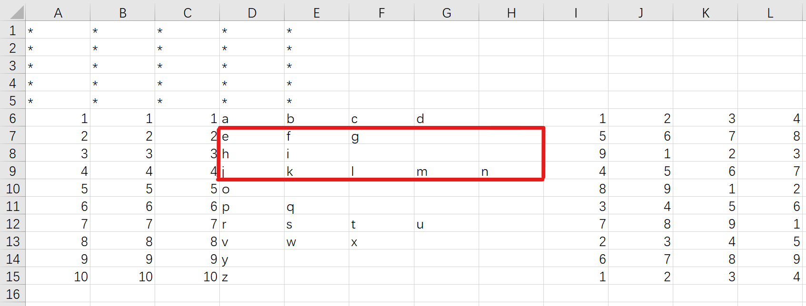

**CSVOperation.Transform(ReadName, StartRow, StartColumn, SaveName = '')**

*Turn the row into column.*

| Parameters' name | type | Description |
| ---------------- | ---- | ----------- |
| ReadName | string | Name of CSV file, without ".csv" |
| StartRow | int | Start row number |
| StartColumn | int | Start column number |
| SaveName | string | Name of output file without ".csv", default: SaveName + "_transform" |

For example, we want to handle a CSV file named "test.csv", the area in the red box will be turned.



Result:


Code:

```
import CSVOperation

CSVOperation.Transform("test", 6, 4)
```